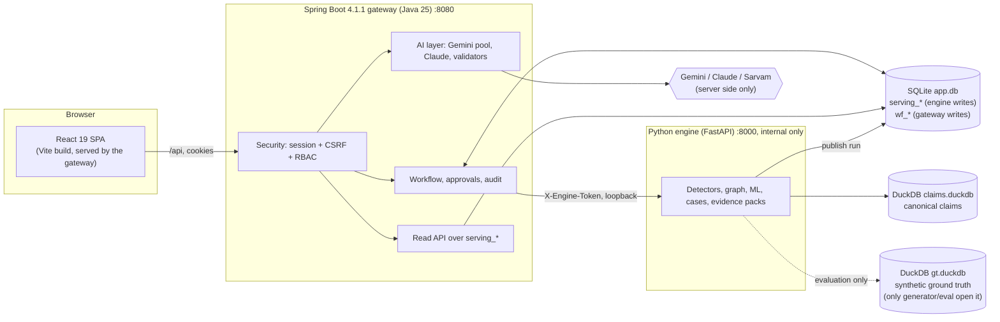
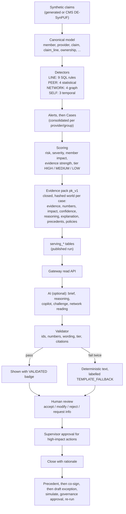
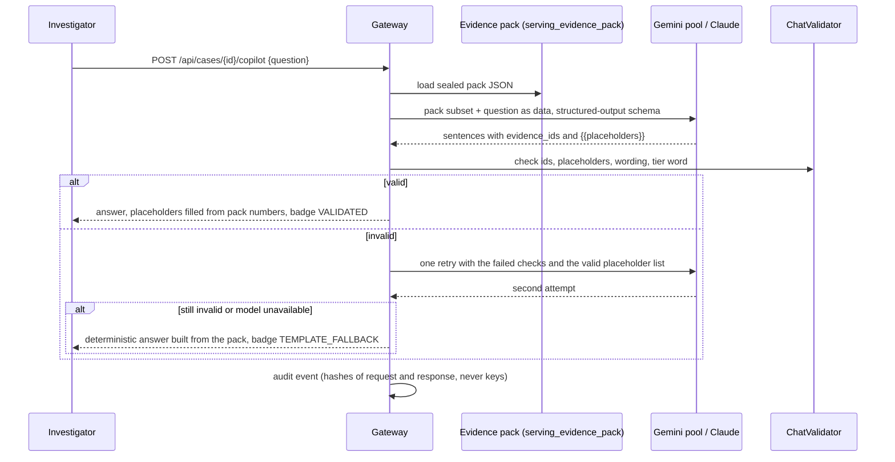
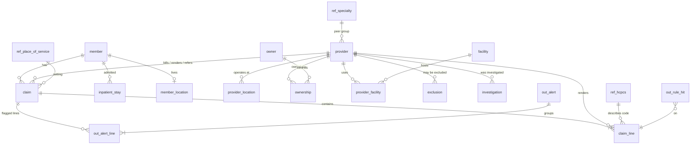
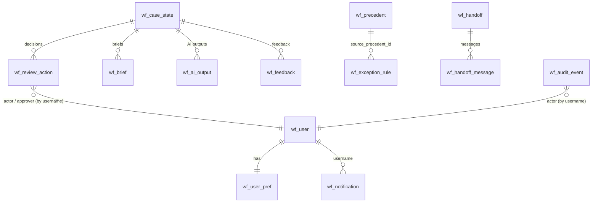
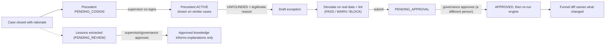

# ClaimShield Nexus: Project Documentation

> All statements below were checked against the code in this repository. Where something is a design choice rather than a measured fact, or could not be verified, it says so. All data in the system is **synthetic**; the platform produces *indicators that need human review*, never findings.

---

## 1. What the project is (the simple version)

Health insurers receive millions of claims. A small share is fraud, waste or abuse (FWA). The Special Investigations Unit (SIU) has limited time, and normal alert tools hand them thousands of unexplained alerts.

**ClaimShield Nexus** turns those alerts into a **short, ranked list of cases**, each with its evidence, how sure the system is, who and what is connected, and a recommended human action. People decide; the AI only explains.

### Problem statement (from the hackathon brief, Problem 3 "ClaimShield Nexus")
Fraud is rarely visible in a single claim. Signals appear only when claims are connected to provider behaviour, member utilisation, facilities, referrals, ownership, timing, payments and earlier investigations. The brief asks for a platform that:

| Brief requirement | Where it is implemented |
|---|---|
| Load and analyse synthetic claims and related data | `engine/claimshield/generate/mini.py` (generated data), `adapters/cms_desynpuf.py` (real CMS synthetic data) |
| Detect duplicate billing, upcoding, unbundling, phantom services, excessive utilisation, impossible timing | 20 detectors (9 line rules, 4 peer, 4 graph, 3 temporal) in `engine/claimshield/detect/*` and `graph/graph.py`, registry in `reference.py` |
| At least two complementary approaches | Rules, peer statistics, temporal analytics (CUSUM etc.), graph analytics, ML prediction |
| Show relationships | Investigation canvas (`web/src/features/investigate`) |
| Predict repeat/escalating FWA over 30/60/90 days | `engine/claimshield/predict/*` |
| SIU queue ranked by risk, dollars, member impact, severity, evidence strength, capacity | `cases/score.py`, `gateway/.../api/QueueService.java`, `web/src/pages/Queue.tsx` |
| Explainable investigation brief | `gateway/.../brief/*` (validated Claude brief or deterministic template) |
| Responsible AI, human in the loop, fail safely | Validators, two-person approval, audit chain, deterministic fallbacks |

### Objectives
1. Move from thousands of alerts to a small, evidence-backed, ranked case list.
2. Keep risk, evidence and confidence as three separate ideas.
3. Make every AI sentence checkable against a sealed evidence pack.
4. Keep a human in every decision and record it in a tamper-evident audit trail.
5. Learn from closed cases, but only through governed, human-approved steps.

### Real-world applications
Health-payer SIUs, payment-integrity teams, and (with different rules) any domain where weak signals from many records must be combined, ranked and explained to a reviewer. *This is a prototype on synthetic data; no real-world deployment or accuracy claim is made.*

---

## 2. Architecture

Three processes share one SQLite file. Each table family has exactly one writer.

**Why this split.** The detectors are data-science code (pandas, scikit-learn, DuckDB), which Python does best. Workflow, security and audit are transactional business logic that Java/Spring does best. One shared SQLite file keeps the prototype to a single volume; the "one writer per table family" rule (enforced by a test that forbids `wf_` in engine code) prevents the two languages from corrupting each other.

### Pipeline: from claims to a human decision

### Data flow for one AI answer

---

## 3. Technology stack and why

| Layer | Technology (verified version) | Why chosen | Alternative and trade-off |
|---|---|---|---|
| Frontend | React 19.2, TypeScript 6, Vite 8, React Router 7 | Mature component model, type safety, fast builds | Next.js would add SSR the app does not need; Vite output embeds in the jar so one origin, no CORS |
| Styling | Tailwind CSS 4, shadcn/ui (Radix), lucide icons | Consistent tokens, accessible primitives | Hand-written CSS is slower to keep consistent |
| Motion | GSAP 3.15 (+ScrollTrigger, SplitText), Lenis smooth scroll, CSS keyframes | Timeline control for hero and page transitions | CSS-only is simpler but cannot sequence; motion is disabled for reduced-motion users |
| Data viz | Recharts 3 (dashboard), custom SVG (investigation canvas) | Recharts for standard charts; a custom SVG scene for tiles, camera and signals | Cytoscape was used first; a custom scene gives typed tiles, travelling signals and a camera at the cost of writing layout, pan/zoom and hit-testing |
| State/data | TanStack Query 5 | Caching, polling (notifications every 4 s), mutations | Redux is heavier for server state |
| i18n | i18next, 11 languages (en + 10 Indian) | Judges and investigators in India | Translations are generated at build time with Sarvam and spot-checked; evidence text stays English so figures stay checkable |
| Gateway | Spring Boot 4.1.1, Java 25, Spring Security, Spring MVC, JDBC (`JdbcTemplate`), Hikari | Strong security and transaction model, typed validation | Node/Express is lighter but weaker on structured security; JPA was avoided to keep SQL explicit and the audit chain exact |
| Engine | Python 3.12, FastAPI, pandas, NumPy, SciPy, scikit-learn, NetworkX, DuckDB | Data-science ecosystem; DuckDB queries columnar claims fast | Spark is overkill; pure SQL cannot do robust z-scores, CUSUM or gradient boosting |
| App DB | SQLite (WAL mode, `busy_timeout=5000`, `foreign_keys=on`) | Zero-ops, one file, ACID | Postgres is the production choice (concurrent writers, row security); noted as a limitation |
| Claims DB | DuckDB files (`claims.duckdb`, `gt.duckdb`) | In-process analytics | Warehouse (BigQuery etc.) for real scale |
| AI | Gemini pool (`gemini-3.1-flash-lite` default, 1 to 6 keys), Claude (Anthropic SDK), Sarvam (translate, STT, TTS) | Free-tier-friendly key rotation; Claude for validated briefs; Sarvam covers Indian languages | A single provider is simpler but has one rate limit and one failure mode |
| Tests | pytest, JUnit 5/MockMvc, Vitest + Testing Library, Playwright | One layer per concern plus real-browser e2e | |
| Packaging | Docker Compose: `gateway` (jar with embedded SPA) + `engine`, shared volume | One command, reproducible | |

---

## 4. Components and what they do

### 4.1 Python engine (`engine/claimshield`)

| Module | Purpose | Notes |
|---|---|---|
| `generate/mini.py` | Builds the synthetic claims world and **separately** a ground-truth DB with injected FWA schemes and decoys | Ground truth is isolated; a test (`test_only_generation_eval_and_the_orchestrator_may_touch_ground_truth`) fails if any other module opens it (allowed: `generate`, `eval`, `adapters`, orchestrators) |
| `adapters/cms_desynpuf.py` | Ingests the official CMS DE-SynPUF Sample 1 files into the canonical model with a provenance table and a clearly labelled synthetic overlay | See section 8 |
| `detect/rules.py` | 9 SQL rules on exact claim fields (LINE channel) | R-DUP-01, R-PTP-01, R-MUE-01, R-DOD-01, R-EXCL-01, R-DME-01, R-TIME-01, R-GEO-01, R-IP-01 |
| `detect/peer.py` | Peer comparison with robust z-scores and shrinkage (PEER) | S-UPC, S-UTL, S-GHOST, S-DIST |
| `graph/graph.py` | Ownership groups, referral loops/concentration, shared infrastructure (NETWORK) | G-OWNREF, G-LOOP, G-REFCONC, G-INFRA |
| `detect/temporal.py` | CUSUM, growth, ramp against the provider's own history (SELF) | T-CUSUM, T-GROWTH, T-RAMP |
| `cases/*` | Alerts to cases, scoring, queue/dashboard rows | Tier rules in `score.py`: HIGH needs a recorded hard fact on exact dollars, or at least 2 independent channels with strong evidence; otherwise MEDIUM; weak is the Monitor list |
| `evidence/pack.py`, `insight.py` | Builds the closed, hashed evidence pack; computes impact, confidence, routing, reasoning chain, explanations, core-care protection | Pack hash covers all fields; schema in `contracts/schemas/evidence_pack.schema.json` |
| `predict/*` | 30/60/90-day outlook: gradient boosting vs logistic regression, provider- and time-based split, bootstrap intervals, persistence baselines | Trained on a **synthetic** future-risk target; a ranking score, never evidence |
| `brain/*` | Precedents, exceptions DSL, simulation, lint | Recorded-fact rules can never be excepted |
| `eval/*` | Recall (exact), precision lower bound, decoys, ring recovery | Basis is always "synthetic ground truth" |
| `api/main.py` | Internal FastAPI (`/internal/health`, `/rerun`, `/jobs/{id}`, `/exceptions/propose`, `/simulate`, `/precedent/check`) protected by `X-Engine-Token` (constant-time compare) | Not published outside the Docker network |
| `pipeline.py`, `publish.py` | Orchestrates generate, detect, score, publish a numbered run | `python -m claimshield.pipeline` |

### 4.2 Java gateway (`gateway/src/main/java/com/claimshield/gateway`)

| Package | Key classes | Purpose |
|---|---|---|
| `auth` | `AuthController`, `UserRepository`, `UserSeeder`, `Role`, `AppUser` | Login/logout/me, preferences, demo role switch; BCrypt(10); login throttle after 8 failures per name per minute |
| `config` | `SecurityConfig`, `CsrfCookieFilter`, `SpaForwardConfig`, `Tx`, `Json` | Session + double-submit-style CSRF cookie, 401/403 as RFC-7807-style problems, SPA route forwarding, write transactions, canonical JSON |
| `api` | `ReadController`, `QueueService`, `ServingRepository`, `ApiExceptionHandler`, `Problems` | Read-only views over `serving_*`, queue ranking/filters, uniform errors (404/405/415/422/429/500 mapped) |
| `workflow` | `CaseWorkflowService`, `WorkflowController`, `Dto` | Review actions, two-person approval, execute, close; idempotency key support |
| `knowledge` | `KnowledgeService`, `KnowledgeController`, `KnowledgeSeeder` | Precedents, co-sign, exceptions (propose, simulate, submit, approve, retire), re-run |
| `brief` | `BriefService`, `BriefValidator`, `ChatValidator`, `PackIndex`, `BriefTemplate` | Seven-element brief with validator V1-V15; deterministic template fallback |
| `ai` | `GeminiPool`, `GeminiLlmClient`, `RoutingLlmClient`, `HttpLlmClient`, `ChatService`, `ChatTools`, `SpeechService`, `AiAdminController` | Key rotation, rate windows, circuit breaker, chat over validated facts, voice, `/api/ai/usage` |
| `reasoning` | `ReasoningService`, `CopilotService`, `LearningService`, `HandoffService`, `NotificationService`, `ReasoningController` | Grounded reasoning, copilot, challenge, network reading, feedback and knowledge, human handoff, notifications |
| `audit` | `AuditService`, `AuditController` | Hash-chained append-only log, verification, filters |
| `engine` | `EngineClient`, `HttpEngineClient` | Server-to-engine calls with the shared token |

### 4.3 Frontend (`web/src`)

| Area | Files | Purpose |
|---|---|---|
| Shell | `components/Shell.tsx`, `NotificationBell.tsx`, `CommandPalette.tsx`, `ChatDock.tsx`, `ErrorBoundary.tsx` | Sidebar/header, bell + toasts, Ctrl+K search, assistant, crash containment |
| Pages | `Landing`, `Login`, `Onboarding`, `Dashboard`, `Queue`, `Case`, `Lab`, `Precedents`, `Governance`, `Audit`, `Library`, `Agent` (specialist desk) | One route each, see `App.tsx` |
| Investigation canvas | `features/investigate/{model,simulation,Canvas,Inspector,SimDock,InvestigatePage,NetworkReading}` | Graph, inspector, copilot, playback |
| Insight views | `components/insight/*` | Risk/evidence/confidence, impact, reasoning chain, copilot, challenge, learning |
| Kit | `components/kit/*` | Section/Panel/Ticker/DitherField/LogoGlobe etc. ported from the Allotiq design system |

---

## 5. Domain model, entities and relationships

### 5.1 The three databases

| Store | Owner (only writer) | Contents |
|---|---|---|
| `claims.duckdb` (canonical) | engine (generator or adapter) | The claims world (below) |
| `gt.duckdb` | generator/adapter, read by `eval` | `gt_scheme`, `gt_claim_label`, `gt_provider_split`, `gt_decoy_provider` (answer key; never read by detectors) |
| `app.db` (SQLite) | `serving_*`: engine; `wf_*`: gateway | Published results and all workflow state |

### 5.2 Canonical claims model (DuckDB, `engine/sql/canonical_schema.sql`)

Reference tables: `ref_specialty`, `ref_hcpcs`, `ref_ncci_ptp`, `ref_mue`, `ref_place_of_service`. Output tables: `out_rule_hit`, `out_alert`, `out_alert_line`. `gen_manifest` records generator seed and data hashes. (The relationship diagram is a simplification of the foreign keys in the SQL file; check the file for exact columns.)

### 5.3 Serving tables (written by the engine into `app.db`)

`serving_run`, `serving_current_run`, `serving_case` (tier, risk_30/60/90, dollars, member impact, severity, evidence strength, JSON headers), `serving_evidence_pack` (pack JSON + sha256), `serving_case_line`, `serving_graph`, `serving_timeline`, `serving_case_precedent`, `serving_monitor_item`, `serving_funnel`, `serving_dashboard`, `serving_eval`, `serving_policy_section`, `serving_rule_registry`, `serving_glossary`, `serving_help_article`, `serving_precedent_seed`, `serving_knowledge_lint`. Run-specific tables (case, pack, lines, graph, timeline, funnel, dashboard, eval) are keyed by `run_id`, so a re-run adds a new run instead of overwriting; the reference tables (policies, rules, glossary, help, seeds, lint) are not per-run.

### 5.4 Workflow tables (written by the gateway; 20 `wf_*` tables)

| Table | Purpose | Key constraints |
|---|---|---|
| `wf_user`, `wf_user_pref` | Accounts (BCrypt hash), role, language, onboarding flags | role CHECK in the four roles |
| `wf_case_state` | Status per case | status in NEW, TRIAGED, IN_REVIEW, NEED_INFO, ACTION_PROPOSED, ACTION_APPROVED, ACTION_TAKEN, CLOSED |
| `wf_review_action` | Each human decision plus the AI proposal and the human decision JSON | action in ACCEPT/MODIFY/REJECT/REQUEST_INFO; status RECORDED/PENDING_APPROVAL/APPROVED/REJECTED/EXECUTED; `idempotency_key` UNIQUE |
| `wf_brief` | Stored brief with prompt/response hashes and validation | UNIQUE (case_id, pack_sha256) |
| `wf_precedent` | Closed-case precedents (SEED or LIVE), feature vector, status PENDING_COSIGN/ACTIVE/SUPERSEDED/RETIRED | disposition CONFIRMED/UNFOUNDED/EDUCATION/INSUFFICIENT |
| `wf_exception_rule` | Exceptions with versions; effect DOWNGRADE_TO_MONITOR or SUPPRESS_ALERT; status DRAFT/SIMULATED/PENDING_APPROVAL/APPROVED/REJECTED/RETIRED; lint PASS/WARN/BLOCK | PK (exc_id, version) |
| `wf_job` | Re-run jobs | |
| `wf_chat_session`, `wf_chat_message` | Assistant conversations | |
| `wf_audit_event` | Hash-chained audit log | SQLite triggers abort UPDATE and DELETE (append-only) |
| `wf_ai_output` | Cached reasoning/challenge/network outputs | UNIQUE (case_id, purpose, pack_sha256) |
| `wf_feedback` | Structured feedback (USEFUL/NOT_USEFUL, categories, decision) | |
| `wf_knowledge_item` | Lessons extracted after closure, PENDING_REVIEW to APPROVED/REJECTED | approved by a different person |
| `wf_handoff`, `wf_handoff_message` | Human handoff conversations | status WAITING/ACTIVE/CLOSED |
| `wf_dm_thread`, `wf_dm_message`, `wf_dm_read` | Direct messages: one thread per pair of people (UNIQUE user_a/user_b), messages with an optional `case_id`, per-user read position | participants only; auditors excluded |
| `wf_notification` | Per-person notifications, folded by (user, kind, ref) while unread | index on (username, read_at, created_at) |

Links between `wf_*` rows and users are by **username text**, not foreign keys, except `wf_user_pref` and `wf_handoff_message.handoff_id`. Links from `wf_*` to cases are by `case_id` text into `serving_case` (a different writer's table), so they are deliberately not enforced as foreign keys.

---

## 6. The core ideas explained simply, then technically

### Risk, evidence, confidence are different
- **Simple:** risk = how much attention a case deserves; evidence = how much proof there is; confidence = how sure we are, derived from evidence, never from risk.
- **Technical:** `insight.build_insight` computes a `confidence` block. Tier equals confidence level (HIGH/MEDIUM/LOW). Routes: `HIGH_NONBLOCKING` (always `requiresHuman: true`), `EXPERT_REVIEW`, `ESCALATE_INSUFFICIENT` with the fixed text "Insufficient evidence - human review required." Contradicting signals (unfounded precedents, approved exceptions, no recorded fact, estimated dollars above exact, high-acuity members, rural providers) can stop a HIGH case being automation-eligible.
- **Core-care protection:** lines with emergency, critical care, dialysis or chemotherapy codes (`CORE_CARE_PREFIXES`, a design list, not a clinical rule) add a contradicting signal and make a case never automation-eligible.

### Evidence packs
A closed JSON "world" per case: evidence items (with observed values), numbers (placeholders such as `{{IM1.value}}`), impact items IM1..IM8 (+ core care), reasoning steps RS1..RS7, explanation, precedents, policies, limitations; hashed with SHA-256. Anything the AI says must cite ids that exist in this pack.

### AI grounding and validation
Structured output (JSON schema), placeholders for numbers, citations per sentence, forbidden-word list (no "fraud", intent words), a check that the stated tier equals the computed tier, one retry with the failed checks and the list of valid placeholders, then a labelled deterministic fallback. The model can never decide, calculate dollars, or change confidence.

### Gemini key pool (`GeminiPool`)
Per-key sliding 60 s window for requests and tokens (80% headroom), model-family default limits overridable by `GEMINI_RPM`/`GEMINI_TPM`, cooldown on HTTP 429 (honours Retry-After), learned quota, 3 consecutive failures open a 60 s breaker, 400/403 parks a key for 15 minutes, 10-minute request cache, 6 s maximum wait before the deterministic fallback. Usage (no secrets) at `GET /api/ai/usage` (not available to investigators).

### Governed learning (the "Second Brain")

Approved knowledge never changes a score or a rule. Recorded-fact rules cannot be excepted.

### Human handoff and notifications
**Direct messages** (menu *Messages*, route `/agent`) are separate from the assistant: two people, any message can carry a case, only the two can read it, the other person is notified. **Assistant handoff:** a person asks for a specialist (chat intent or "Connect me to a human specialist"). A `wf_handoff` row is created, every supervisor and governance user gets a notification, one of them joins from the Specialist desk, and both chat in the same conversation (Server-Sent Events, 1 s pump, **not WebSocket**). Personal identifiers (SSN, email, phone patterns) are refused; each message is audited by SHA-256 only. Notifications are stored per user and shown when that user signs in or on the next 4 s poll.

### Investigation canvas
Entities and links come only from real records (stored graph, flagged claim lines, evidence pack). Layout is a deterministic force relaxation; a tile you move is pinned. Playback steps are built from the case: ownership, claims, members, each evidence item, related providers, risk build-up (ends on exactly the engine's score), recommended human review. Only the primary provider has a risk; others show none. Links are labelled derived, not confirmed.

---

## 7. API reference (verified against the controllers)

All paths are under `/api`, JSON, session cookie + `X-XSRF-TOKEN` header for non-GET. Errors are `application/problem+json` with `code`, `title`, `detail`.

| Area | Endpoints |
|---|---|
| Auth/profile | `POST /auth/login`, `POST /auth/logout`, `GET /auth/me`, `PUT /me/prefs`, `POST /auth/switch-role` (demo only) |
| Read | `GET /health`, `/dashboard`, `/funnel`, `/queue` (filters, horizon, capacity), `/monitor`, `/runs`, `/runs/current`, `/eval`, `/compounding`, `/cases/{id}`, `/cases/{id}/evidence`, `/claims`, `/graph`, `/timeline`, `/precedents`, `/reviews`, `/brief` |
| Workflow | `POST /cases/{id}/review` (Idempotency-Key), `POST /review-actions/{id}/approve`, `/execute`, `POST /cases/{id}/close` |
| Knowledge | `GET /precedents`, `GET /cases/{id}/precedents`, `POST /precedents/{id}/cosign` (a precedent is created when a case is closed), `/exceptions` (propose, simulate, submit, approve, retire, explain), `POST /cases/{id}/knowledge/extract`, `/knowledge-items`, `/knowledge-items/{id}/decision`, `GET /knowledge/{policies,rules,glossary,help,lint,graph}`, `POST /runs/rerun`, `GET /jobs` |
| AI | `GET/POST /cases/{id}/brief`, `/reasoning`, `/precedent-reasoning`, `/challenge`, `/network-analysis`; `POST /cases/{id}/copilot`; `POST /chat`, `GET /chat/{session}`; `POST /voice/{chat,speak,transcribe}`; `GET /ai/usage` |
| Feedback/memory | `POST/GET /cases/{id}/feedback`, `GET /feedback/summary`, `GET /cases/{id}/institutional-memory`, `GET /learning/growth` |
| Direct messages | `GET /people`, `GET/POST /dm/threads`, `GET /dm/threads/{id}`, `POST /dm/threads/{id}/messages` (`text`, optional `caseId`), `POST /dm/threads/{id}/read` |
| Handoff | `POST /handoff`, `GET /handoff/mine`, `GET /handoff/{id}`, `POST /handoff/{id}/messages`, `GET /handoff/{id}/stream` (SSE), `POST /handoff/{id}/close`, `GET /handoff/{id}/transcript`, `GET /agent/queue`, `POST /agent/handoffs/{id}/join` |
| Notifications | `GET /notifications`, `POST /notifications/read` `{ids}` or `{all:true}` |
| Audit | `GET /audit`, `GET /audit/verify` |

Engine (internal, `X-Engine-Token`): `/internal/health`, `/internal/rerun` (202), `/internal/jobs/{id}`, `/internal/exceptions/propose`, `/internal/simulate`, `/internal/precedent/check`.

---

## 8. Datasets

| Dataset | What it is | Status |
|---|---|---|
| Generated (default) | `generate/mini.py`: synthetic members/providers/claims/ownership/referrals with injected FWA schemes and decoy look-alikes, ground truth kept in `gt.duckdb`. Seed fixed so runs are reproducible | Default for the demo; Docker's engine generates it on first start |
| CMS DE-SynPUF Sample 1 | Official CMS synthetic Medicare files in `data/raw/cms_desynpuf/sample1`, loaded by `adapters/cms_desynpuf.py` into `data/cms/` (`claims.duckdb`, `gt.duckdb`, `app-cms.db`, `validation.json`) | Built and run through the pipeline (about 614 providers, 81,293 members, 488,000 claims). **Not the default**; the gateway does not serve it unless pointed at `app-cms.db` |

CMS mapping honesty: every field is tagged SOURCE / DERIVED / TRANSFORMED / NOT_AVAILABLE / SYNTHETIC_OVERLAY (table `cms_provenance`). Dates are shifted +15 years into the engine's 2024-2025 window. Specialty, ownership groups (shared tax number) and care-path links are **derived**, not facts. Geography, units and billed amounts do not exist in the source. Overlay recall found 3 of 5 patterns strongly; duplicates (0.07) and utilisation (0) were low and the cause was not investigated.

---

## 9. Security

| Control | Implementation (verified) |
|---|---|
| Authentication | Server session (HttpOnly, SameSite=Lax cookie), BCrypt(10) passwords, dummy-hash compare to avoid user enumeration, login throttle (8 failures/min/name) |
| CSRF | `XSRF-TOKEN` cookie + `X-XSRF-TOKEN` header; login endpoint exempt |
| Authorisation (RBAC) | `requireRole` checks in services; roles INVESTIGATOR, SUPERVISOR, GOVERNANCE, AUDITOR; handoffs readable only by requester, assigned specialist, auditors (read-only); non-participants get 404 |
| Two-person rules | Approvals by a supervisor for PREPAY_REVIEW_FLAG and REFER_EXTERNAL (HIGH cases); precedent co-sign by a different supervisor; exception approval by a different governance user; knowledge approval by a different person |
| Secrets | API keys read from environment (`.env`, git-ignored) by the gateway only; never sent to the browser or logged; a scan found none in tracked files |
| Engine link | Loopback/internal network, shared `X-Engine-Token`, constant-time comparison |
| Audit | Hash chain (`prev_hash`, `hash`), append-only triggers, `GET /audit/verify` |
| Input handling | Bean validation, 3 MB upload cap, PII refusal in handoff, forbidden-word validator on AI output, questions treated as data in prompts |
| Rate limits | Chat 30/min, copilot 12/min, handoff messages 20/min, login 8 failures/min (all in-memory, per process) |
| Headers | Spring Security defaults (nosniff, X-Frame-Options DENY, no-store) |

Known weaknesses: the demo passwords are in a committed CSV (`gateway/src/main/resources/demo-users.csv`); `DEMO_MODE=true` exposes a role switcher; rate limits reset on restart; one SQLite file is not a production data store; no CSP header configured.

---

## 10. Design patterns and OOP principles (as found in the code)

| Pattern / principle | Where |
|---|---|
| Strategy / Adapter | `LlmClient` interface with `GeminiLlmClient`, `HttpLlmClient` (Claude), `RoutingLlmClient` choosing between them; `EngineClient` interface with `HttpEngineClient` |
| Circuit breaker | `CircuitBreaker`, per-key breaker in `GeminiPool` |
| Template method / fallback chain | Brief and reasoning services: model, validate, retry once, deterministic fallback |
| Repository | `UserRepository`, `ServingRepository` (JDBC, no ORM) |
| Single-writer ownership | Engine writes `serving_*`, gateway writes `wf_*` (enforced by a test) |
| Event sourcing-lite | Append-only hash-chained audit log; review actions store the AI proposal and the human decision side by side |
| Idempotency | `Idempotency-Key` on review actions (UNIQUE column) |
| Immutable snapshot | Evidence pack hashed and cached per `pack_sha256` |
| Dependency injection | Spring constructor injection throughout; tests replace the LLM with a bean named `routingLlmClient` |
| Records / value objects | Java records (`Sentence`, `Outcome`, request bodies); TypeScript interfaces mirror them |
| Pure functions | Frontend `model.ts` (layout, path, commands) and `simulation.ts` are pure and unit-tested |
| Encapsulation / single responsibility | One service per concern (`CopilotService`, `HandoffService`, `NotificationService`) |
| Open/closed | New detectors are added to the registry in `reference.py` without changing the pipeline |

---

## 11. Quality evidence (last run in this repository)

| Suite | Result |
|---|---|
| Engine pytest | 232 passed |
| Gateway JUnit | 199 run, 0 failures, 5 skipped (Gemini loopback tests that need a real port) |
| Web Vitest | 76 passed; tsc clean; lint 0 errors |
| Browser e2e (`npm run e2e:ui`) | 5 passed (review flow, wrong password, landing/chat/Lab, investigation canvas, two-person handoff) |
| Browser e2e (`npm run e2e:brain`) | 1 passed (close, co-sign, exception, simulate, approve, re-run, diff) |
| Live Gemini through the gateway | Earlier in development: copilot, challenge, network reading validated with the three keys, no rate limiting |

These numbers describe a point in time; rerun the commands in the demo guide to refresh them.

---

## 12. Limitations and honest gaps

- All accuracy numbers are against **synthetic** ground truth; real-world accuracy is unknown. The 30/60/90 model uses a synthetic target and is a ranking score.
- Handoff uses Server-Sent Events (not WebSocket); notifications poll every 4 s.
- Saved queue views are stored in the browser only.
- The institutional-memory view is a list, not a graph visualisation.
- No Gemini "dataset understanding" summary exists.
- The CMS dataset is built but not the default; two overlay patterns have very low recall; derived relationships are not confirmed.
- Live AI output sometimes fails validation (for example an invented placeholder) and then shows the labelled template; this is by design but visible.
- Docker's gateway runs in `LLM_MODE=template` unless `.env` sets `live`.
- SQLite and in-memory rate limits are prototype choices.
- The investigation canvas has no keyboard graph navigation beyond Tab/Enter/Escape; light mode and mobile were not visually reviewed for the newest screens.
- **Known inaccuracy in the UI:** the landing page's "detectors" figure (`web/src/pages/Landing.tsx`) says 13, which is the number of detectors that have injected positives in the evaluation; the registry in `reference.py` defines 20. Left unchanged because this task forbids code edits; correct it before presenting if you quote that number.
- A full read of every source file was not performed during documentation; module summaries come from reading the key files, schemas, controllers and tests and from the passing test suites.

## Human rating of AI output (review notes)

Every AI output carries a visible **Rate this AI output** strip: **Good** (one click), **Fine** or **Bad** (reason chips such as "Wrong number" or "Too vague", plus optional free text; a reason is required). It appears under the AI reasoning, investigation brief, copilot answers, challenge view, network reading, precedent narrative and chat assistant answers. Per-sentence thumbs remain under AI reasoning, copilot and challenge sentences.

Ratings are stored in `wf_review_note` (`subject_type` AI_OUTPUT, AI_SENTENCE, CRITIQUE_FINDING or KNOWLEDGE_ITEM; verdict GOOD, FINE, BAD, AGREE, DISAGREE, ACCEPT_PROPOSAL or REJECT_PROPOSAL), written through `POST /api/review/notes`, audited as `HUMAN_REVIEW_NOTE` by hash, and listed in Library, Knowledge health, Review log. Auditors cannot rate. A rating never changes a score, rule, policy or case. Library, Knowledge health also offers "Find weaknesses" (`POST /api/knowledge/critique`) and "Propose wording" (`POST /api/knowledge/finetune`); both are Gemini-grounded with a labelled fallback, and nothing is applied automatically.

Note: an existing database created before this change keeps the old CHECK constraints on `wf_review_note`; drop that table once (it is recreated on start).
